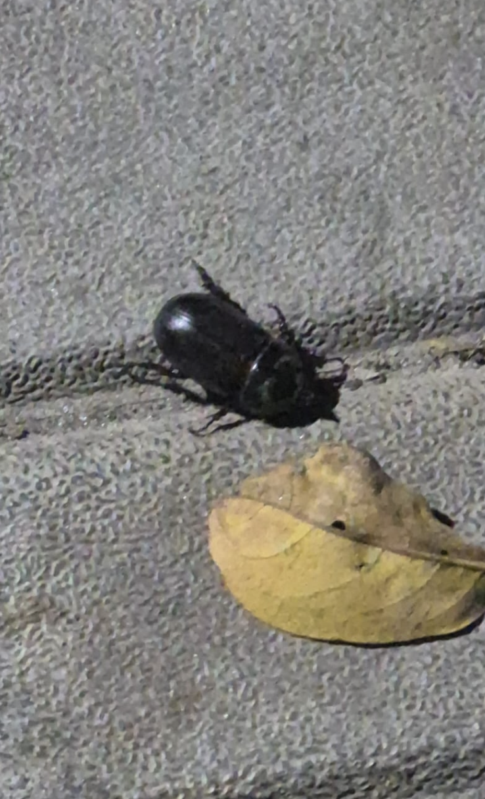

# Beetle

**Common Name:** Beetle
**Scientific Name:** *Coleoptera*
**Category:** Insect
**Location:** AB3 Entrance
**Habitat:** Terrestrial habitats, including soil, leaf litter, grassland, woodland, and other areas with organic matter.

## Photograph

