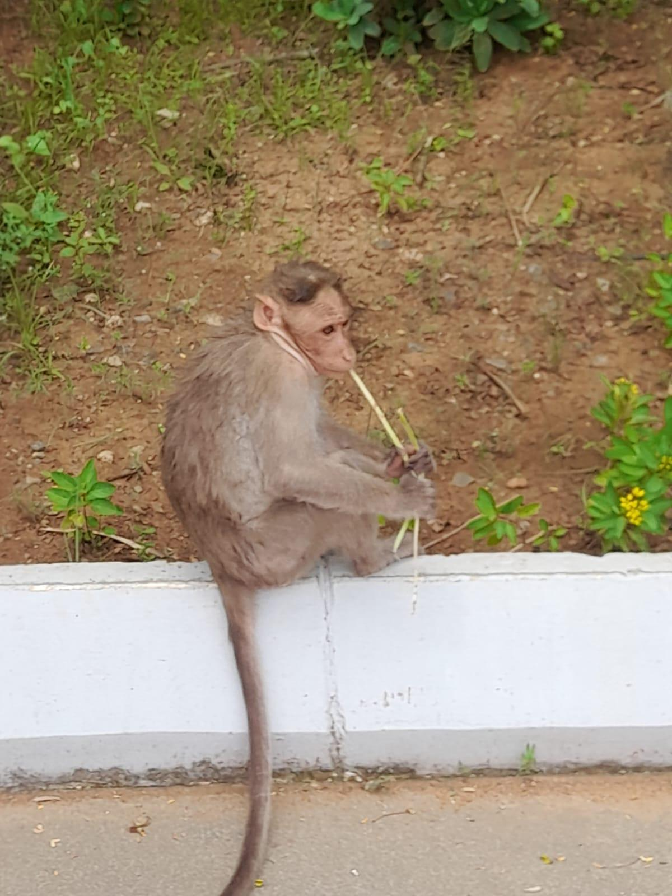

# Bonnet Monkey

**Common Name:** Bonnet Monkey
**Scientific Name:** *Macaca radiata*
**Category:** Mammal
**Location:** Clock Tower
**Habitat:** Evergreen and dry deciduous forest, including forest-human settlement interfaces.

## Photograph

