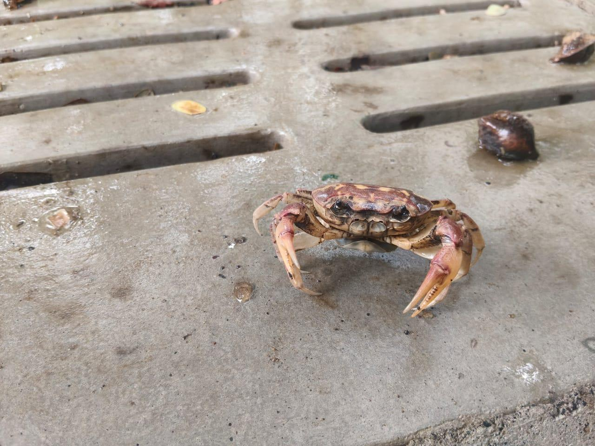

# Cat

**Common Name:** Cat

**Scientific Name:** *Felis catus*

**Category:** Mammal

**Location:** Bench near Open Air Theatre

**Habitat:** Human-associated terrestrial environments; predominantly urban, suburban and agricultural habitats.

## Photograph

