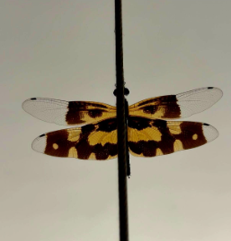

# Common Picture Wing

**Common Name:** Common Picture Wing Dragonfly
**Scientific Name:** *Rhyothemis variegata*
**Category:** Insect
**Location:** AB1
**Habitat:** Frequently found near marshes, ponds, lakes, and paddy fields across South and Southeast Asia.

## Photograph

