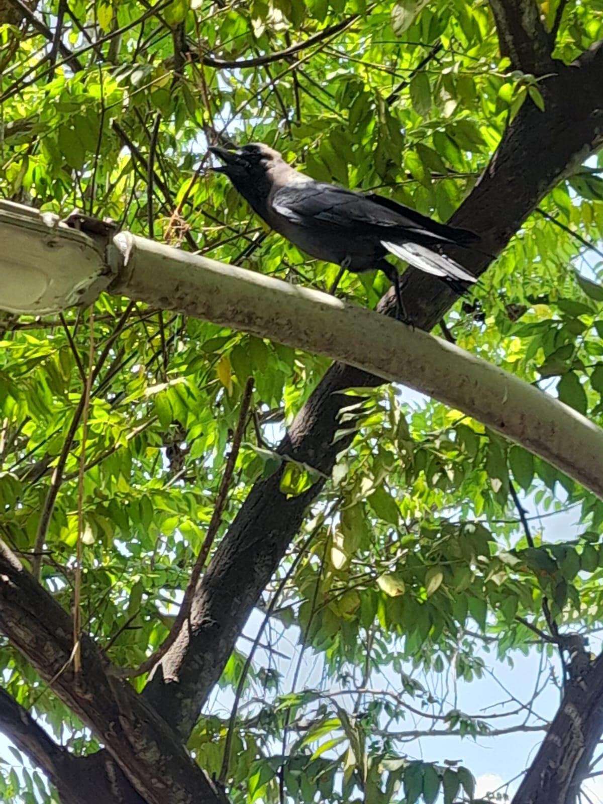

# Crow

**Common Name:** Crow

**Scientific Name:** *Corvus splendens*

**Category:** Bird

**Location:** Trees at Rishabs

**Habitat:** Cultivated areas, open woodland and forest-edge habitats.

## Photograph

