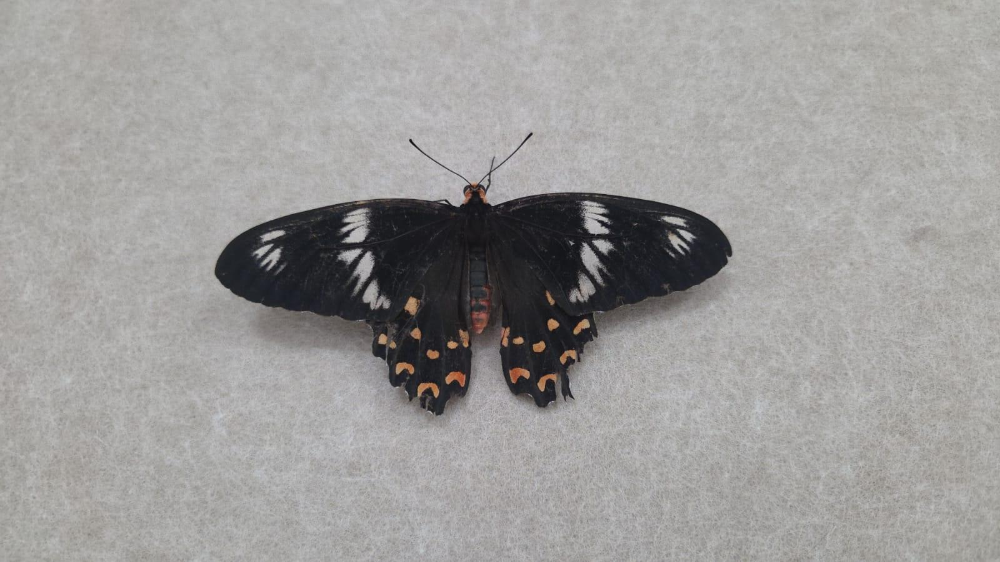

# Mormon Butterfly

**Common Name:** Mormon Butterfly
**Scientific Name:** *Papilio polytes*
**Category:** Butterfly
**Location:** SNUC Library
**Habitat:** Lightly wooded habitats, forest edges, scrub and moist/dry forest environments.

## Photograph

