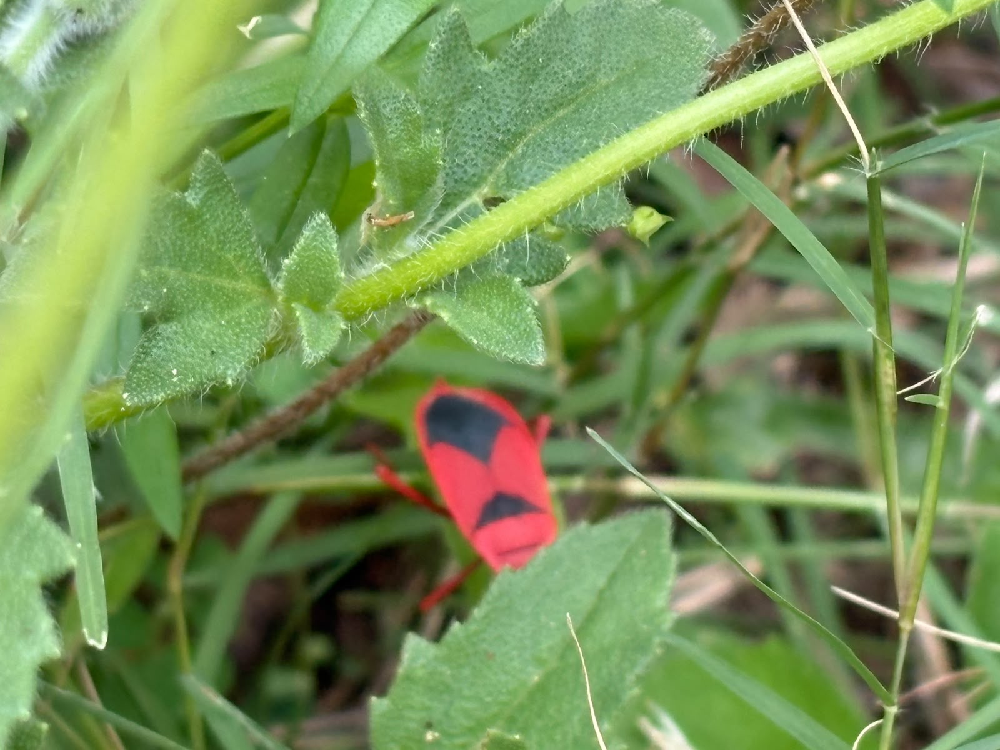

# Red-Cotton Stainer

**Common Name:** Red-Cotton Stainer

**Scientific Name:** *Dysdercus cingulatus*

**Category:** Insect

**Location:** Ladies Hostel

**Habitat:** Terrestrial; associated with Malvaceae plants and other herbaceous vegetation.

## Photograph

