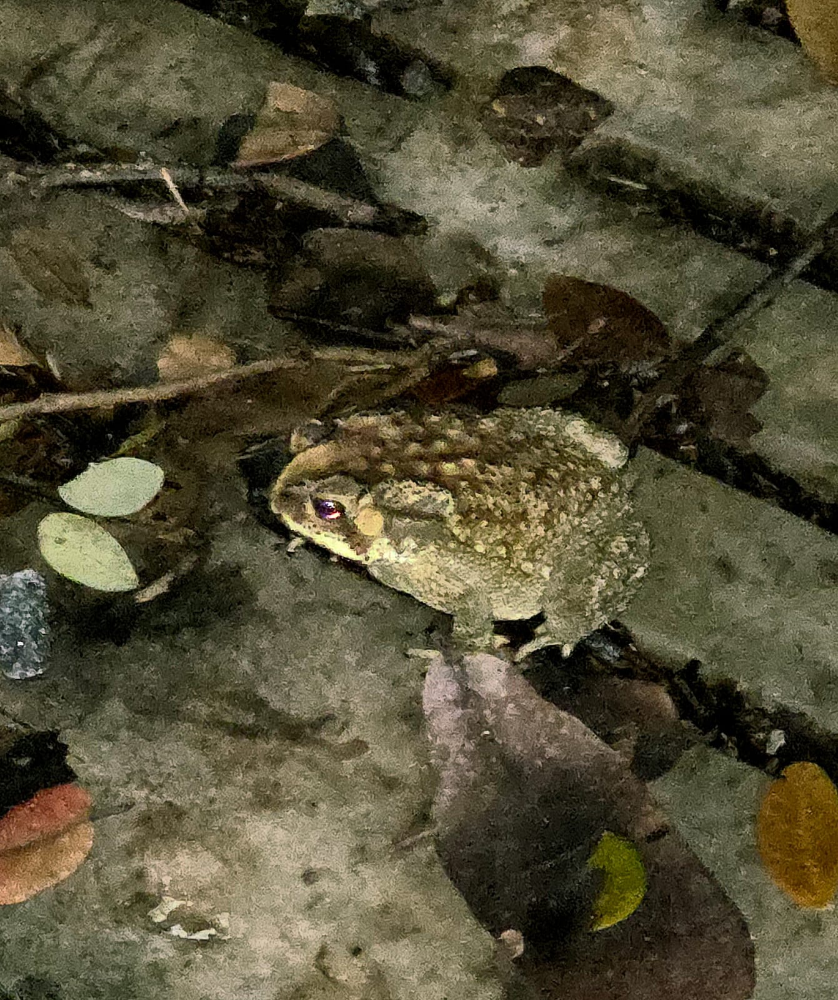

# Toad

**Common Name:** Toad

**Scientific Name:** *Duttaphrynus melanostictus*

**Category:** Amphibian

**Location:** Ladies Hostel

**Habitat:** Terrestrial habitats including moist forest floors, grasslands, agricultural areas, gardens, and areas near freshwater bodies.

## Photograph

