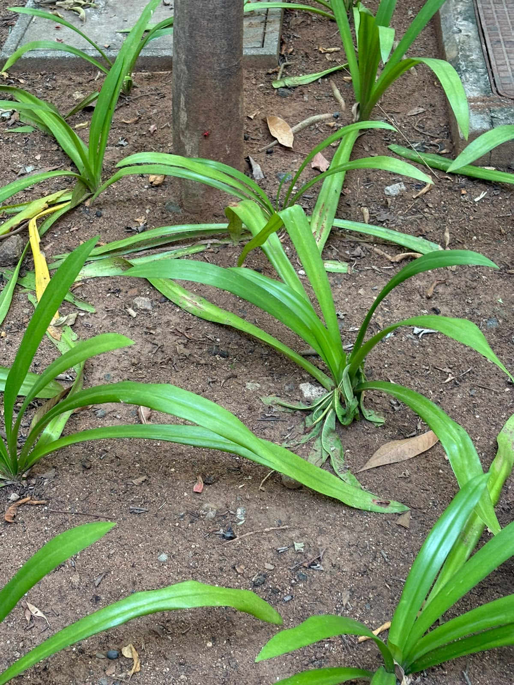

# Beach Spider Lily

**Common Name:** Beach Spider Lily

**Scientific Name:** *Hymenocallis littoralis (Jacq.) Salisb.*

**Category:** Herb

**Location:** Ladies Hostel

**Habitat:** Tropical and subtropical terrestrial habitats; moist, well-drained soils.

## Photograph

