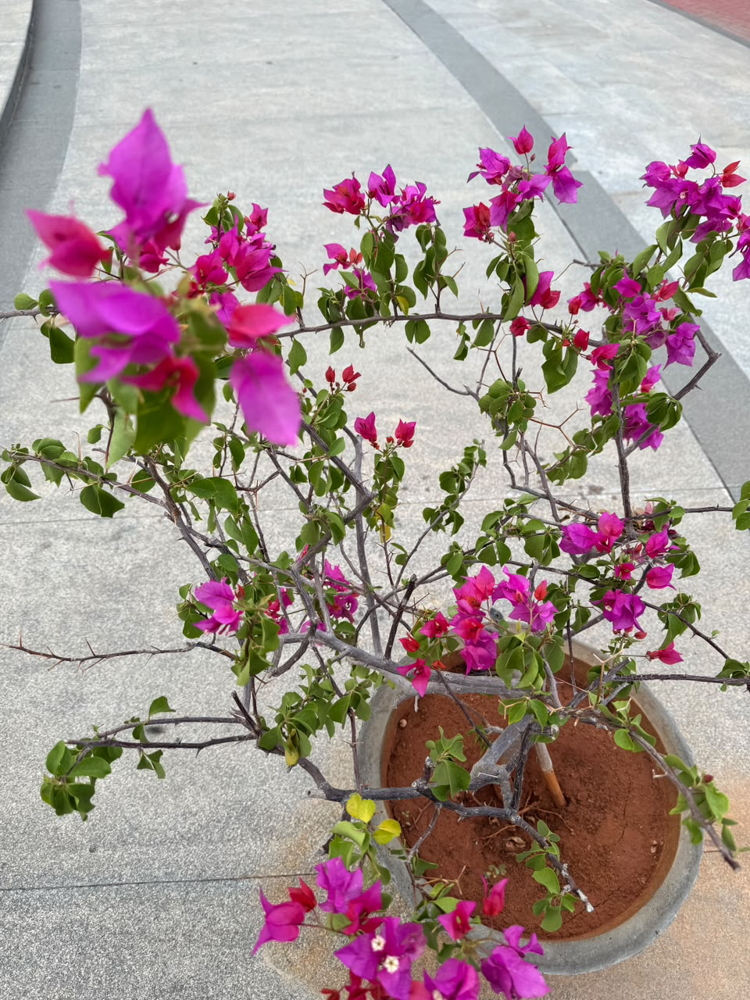

# Bougainvillea

**Common Name:** Bougainvillea
**Scientific Name:** *Bougainvillea*
**Category:** Climber
**Location:** Clock Tower
**Habitat:** Wet tropical vegetation; naturally associated with forest/woodland and shrubland.

## Photograph

