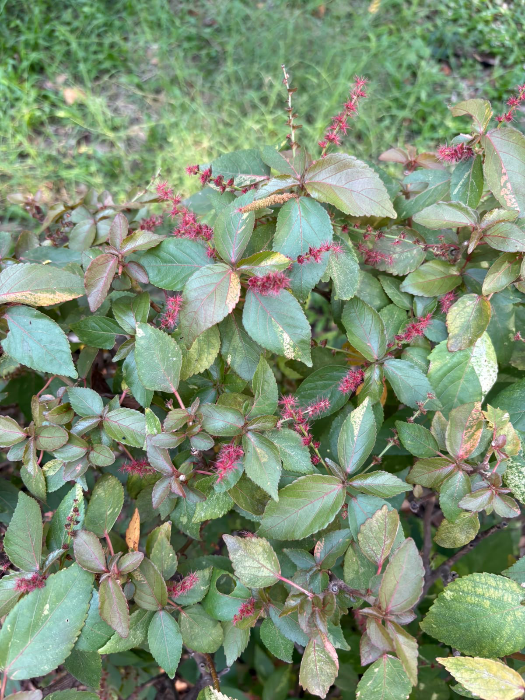

# Chenille Plant

**Common Name:** Chenille Plant
**Scientific Name:** *Acalypha hispida Burm.f.*
**Category:** Shrub
**Location:** Ladies Hostel
**Habitat:** Wet tropical and subtropical habitats.

## Photograph

