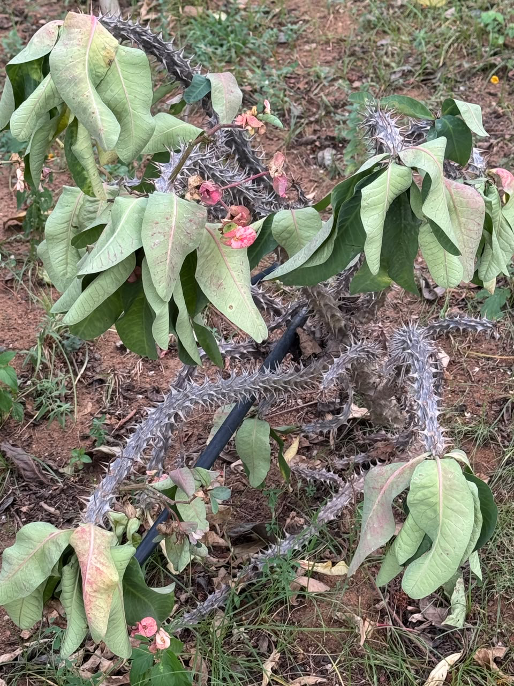

# Crown of Thorns

**Common Name:** Crown of Thorns
**Scientific Name:** *Euphorbia milii*
**Category:** Shrub
**Location:** Clock Tower
**Habitat:** Dry shrubland and desert/dry tropical environments.

## Photograph

