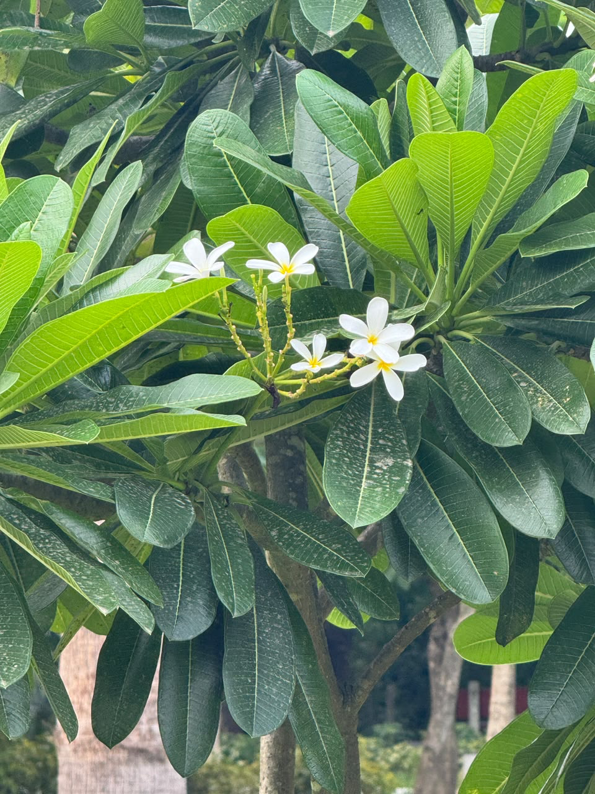

# Frangipani

**Common Name:** Frangipani

**Scientific Name:** *Plumeria*

**Category:** Tree

**Location:** Clock Tower

**Habitat:** Seasonally dry tropical vegetation, particularly dry rocky coastal thickets.

## Photograph

