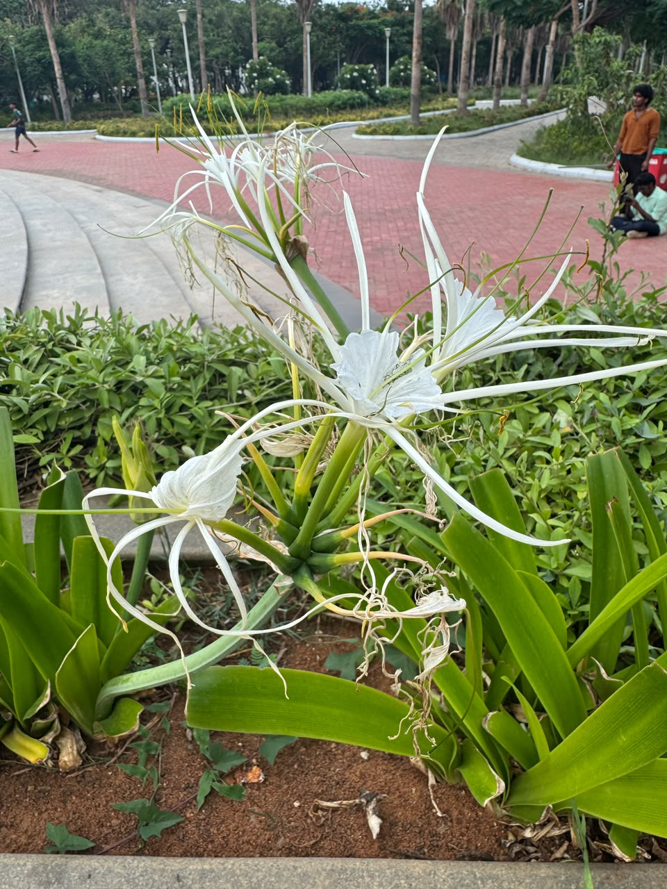

# Giant Spider Lily

**Common Name:** Giant Spider Lily
**Scientific Name:** *Crinum asiaticum*
**Category:** Herb
**Location:** Clock Tower
**Habitat:** Coastal forests, sandy shores and riverbanks, mangrove margins and other lowland coastal habitats.

## Photograph

