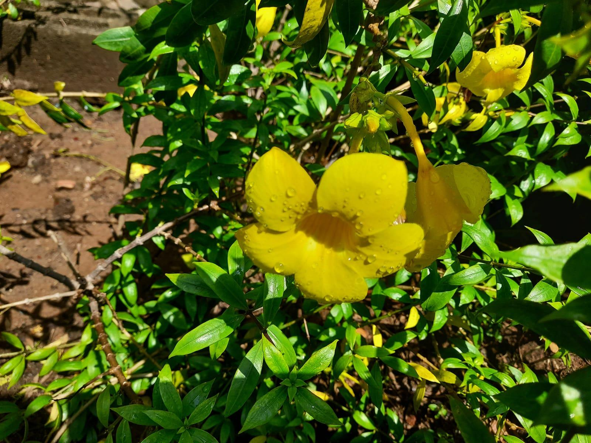

# Golden Trumpet

**Common Name:** Golden Trumpet

**Scientific Name:** *Allamanda cathartica*

**Category:** Climber

**Location:** AB3 Entrance

**Habitat:** Wet tropical habitats; naturally occurring near lowland streams, mangrove swamps and coastal areas.

## Photograph

