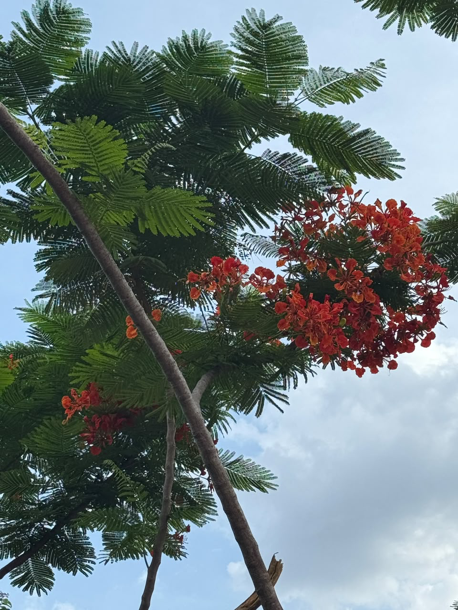

# Gulmohar

**Common Name:** Gulmohar

**Scientific Name:** *Delonix regia*

**Category:** Tree

**Location:** Clock Tower

**Habitat:** Seasonally dry tropical forest, woodland and savanna.

## Photograph

