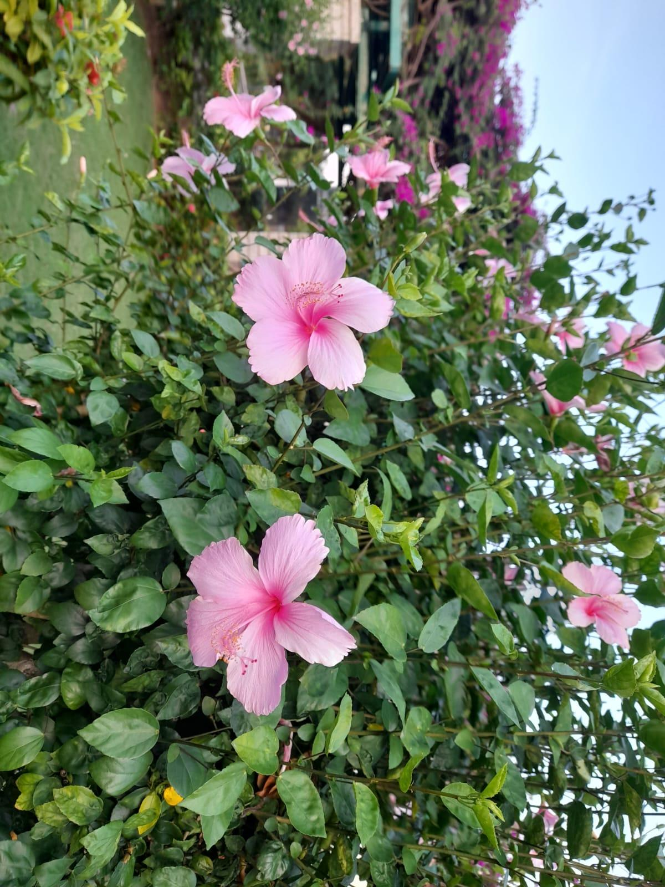

# Hibiscus

**Common Name:** Hibiscus

**Scientific Name:** *Hibiscus rosa-sinensis*

**Category:** Shrub

**Location:** SSN Fountain

**Habitat:** Seasonally dry tropical environments; cultivated throughout tropical and subtropical regions.

## Photograph

