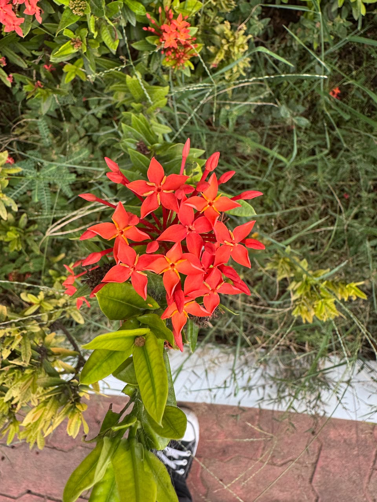

# Jungle Geranium

**Common Name:** Jungle Geranium

**Scientific Name:** *Ixora coccinea*

**Category:** Shrub

**Location:** Clock Tower

**Habitat:** Wet tropical forest and woodland; tropical shrubland.

## Photograph

