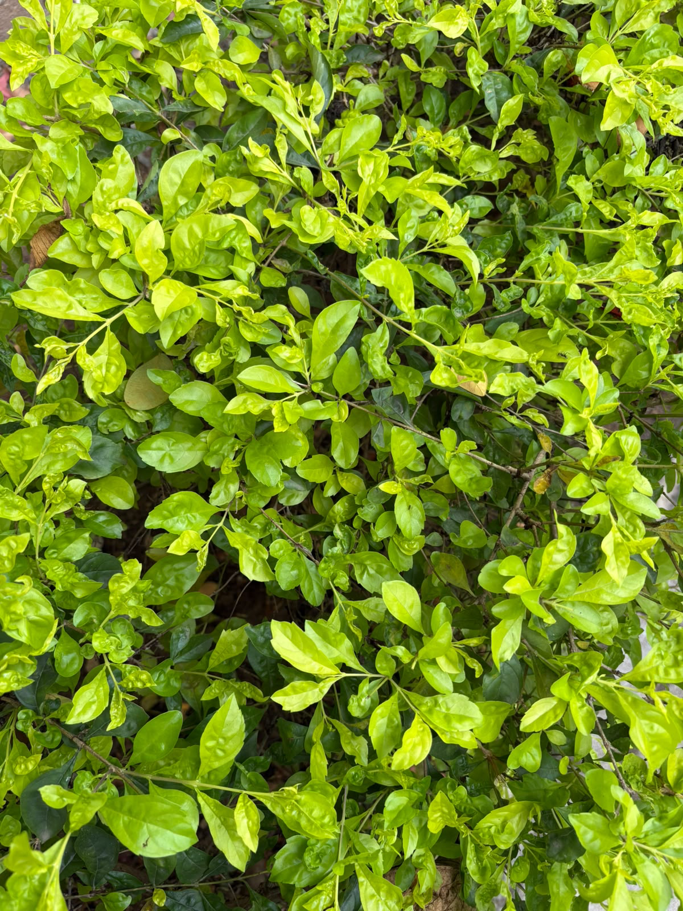

# Kamini

**Common Name:** Kamini
**Scientific Name:** *Murraya paniculata (L.) Jack*
**Category:** Shrub
**Location:** Ladies Hostel
**Habitat:** Tropical and subtropical evergreen and semi-evergreen forests; terrestrial.

## Photograph

