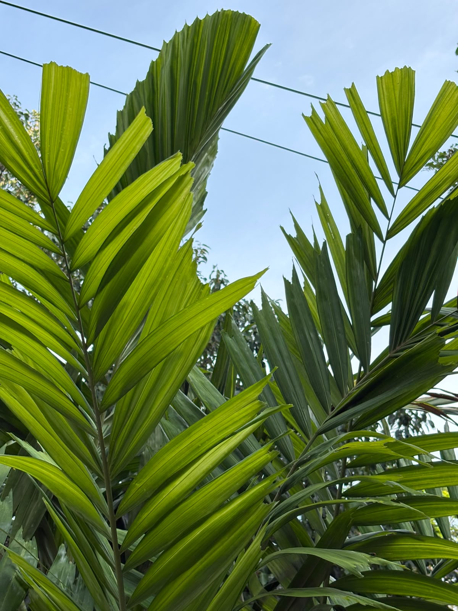

# Mangrove Fan-Palm

**Common Name:** Mangrove Fan-Palm
**Scientific Name:** *Licuala spinosa Wurmb*
**Category:** Tree
**Location:** Ladies Hostel
**Habitat:** Littoral and tidal swamp forests; wet tropical habitats.

## Photograph

