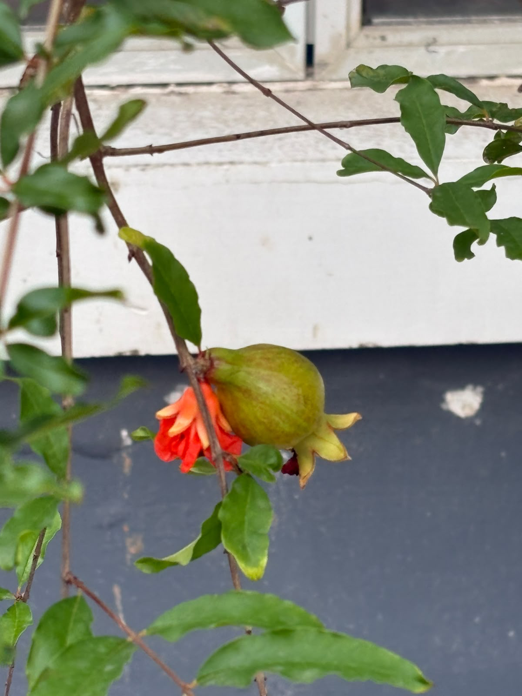

# Pomegranate

**Common Name:** Pomegranate
**Scientific Name:** *Punica granatum*
**Category:** Shrub
**Location:** Ladies Hostel
**Habitat:** Dry tropical and subtropical regions, including dry scrubland, open woodland, and rocky slopes.

## Photograph

