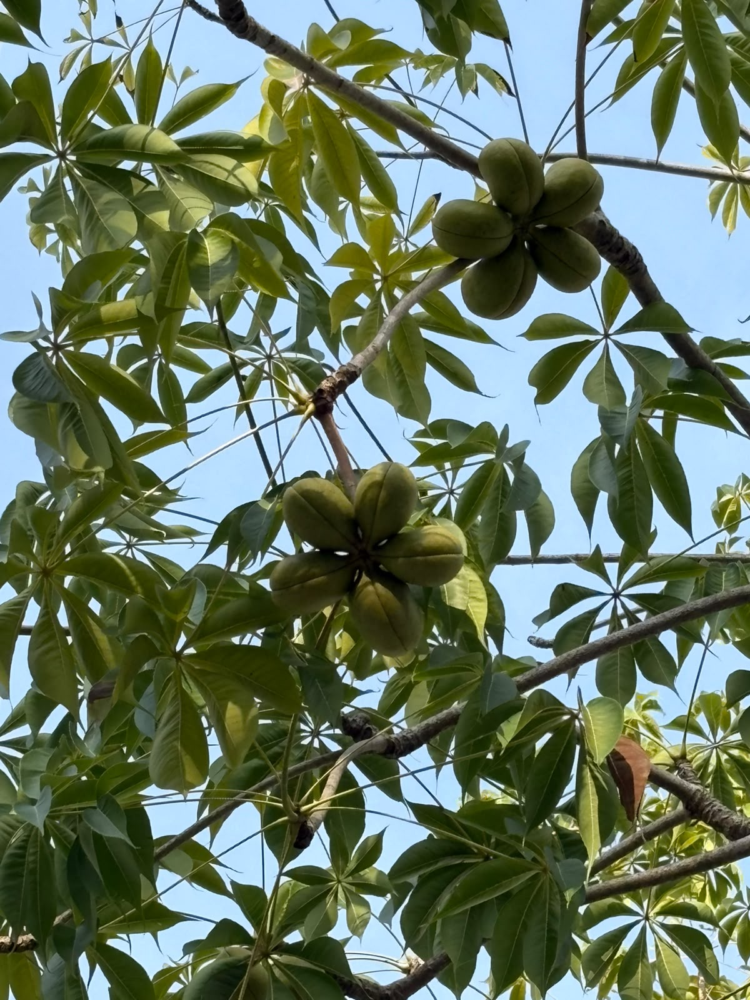

# Saba Nut

**Common Name:** Saba Nut

**Scientific Name:** *Pachira glabra*

**Category:** Tree

**Location:** Ladies Hostel

**Habitat:** Humid tropical forests, lowland rainforest, and alluvial habitats.

## Photograph

