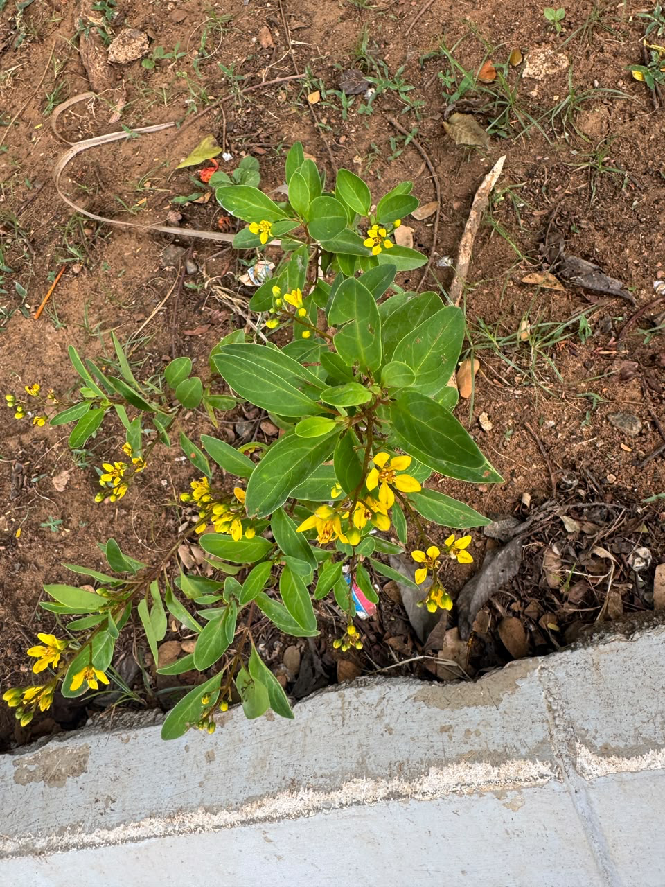

# Scrambled Egg Tree

**Common Name:** Scrambled Egg Tree

**Scientific Name:** *Senna surattensis*

**Category:** Shrub

**Location:** Clock Tower

**Habitat:** Savanna and tropical terrestrial habitats; cultivated and naturalised in some regions.

## Photograph

