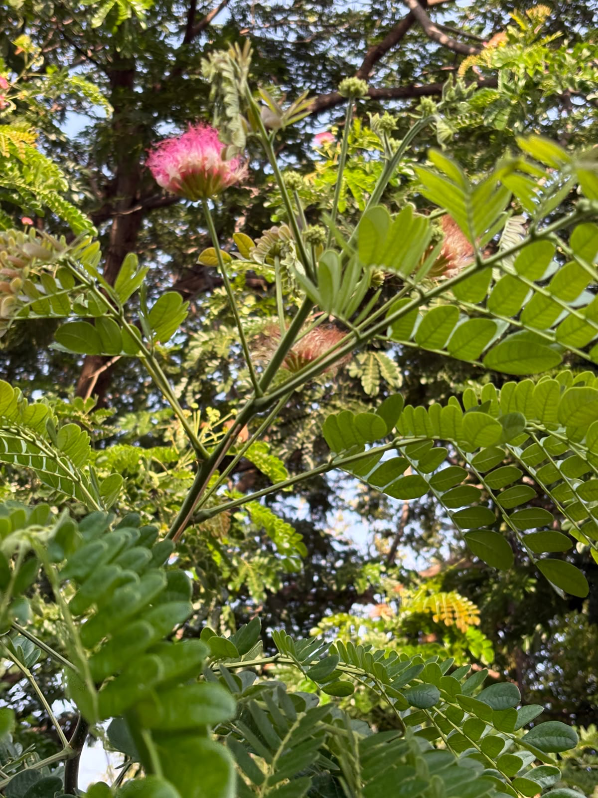

# Silk Tree

**Common Name:** Silk Tree
**Scientific Name:** *Albizia julibrissin Durazz.*
**Category:** Tree
**Location:** Ladies Hostel
**Habitat:** Tropical and subtropical terrestrial habitats; deciduous forest environments.

## Photograph

