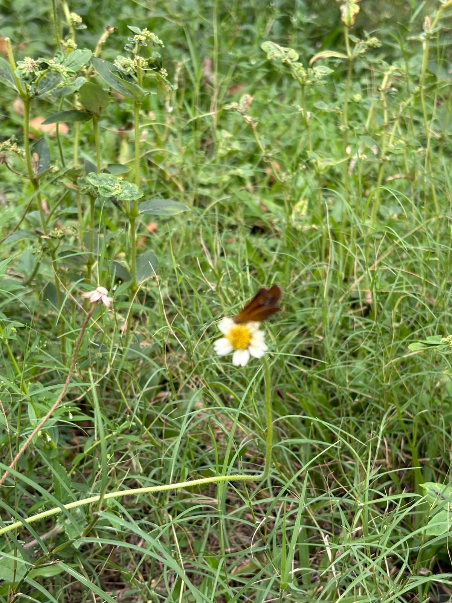

# Tridax Daisy

**Common Name:** Tridax Daisy
**Scientific Name:** *Tridax procumbens L.*
**Category:** Herb
**Location:** Ladies Hostel
**Habitat:** Terrestrial; tropical and subtropical habitats, particularly disturbed soils and open herbaceous vegetation.

## Photograph

