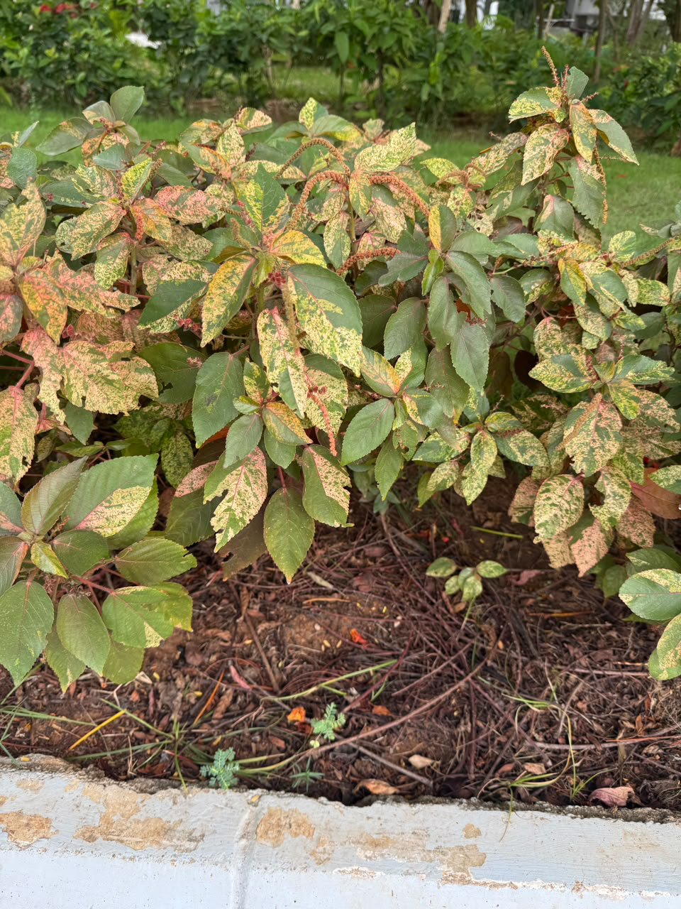

# Variegated Copperleaf

**Common Name:** Variegated Copperleaf
**Scientific Name:** *Acalypha wilkesiana*
**Category:** Shrub
**Location:** Clock Tower
**Habitat:** Wet tropical environments.

## Photograph

