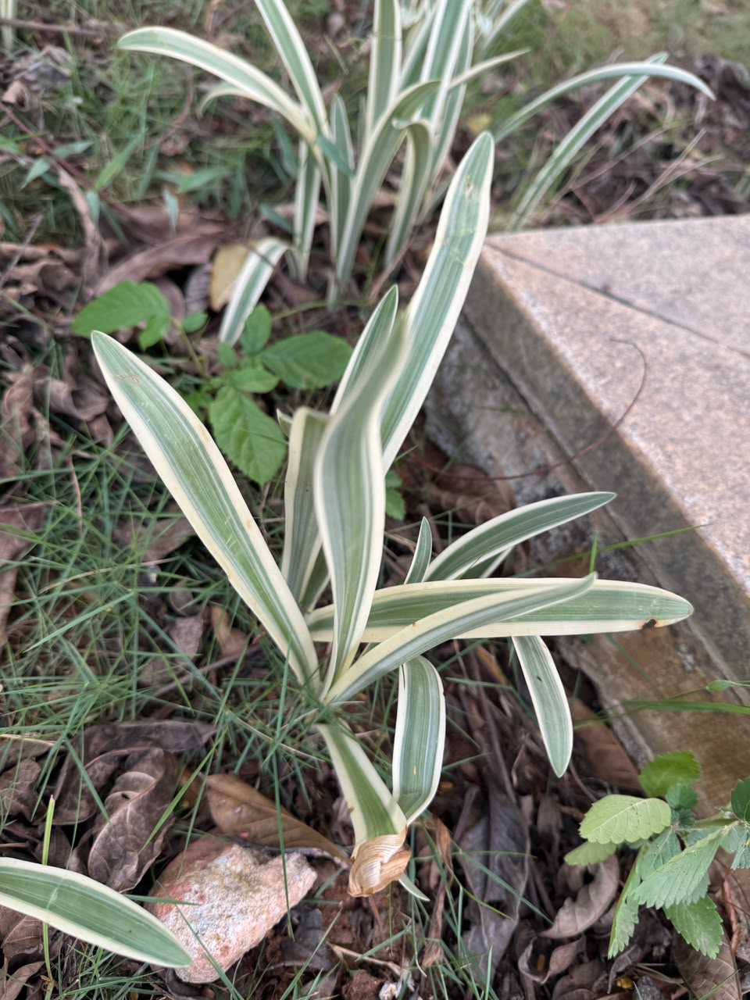

# Variegated Spider Plant

**Common Name:** Variegated Spider Plant

**Scientific Name:** *Chlorophytum comosum*

**Category:** Herb

**Location:** Clock Tower

**Habitat:** Shaded evergreen forest and woodland understory.

## Photograph

