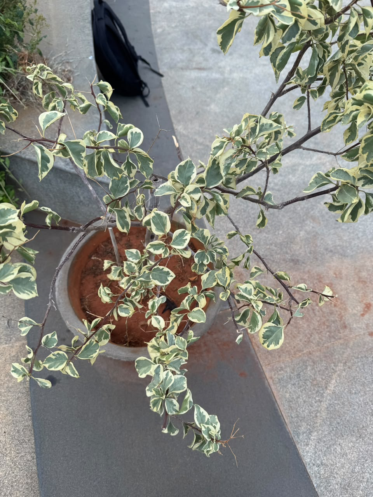

# Variegated Weeping Fig

**Common Name:** Variegated Weeping Fig

**Scientific Name:** *Ficus benjamina 'Variegata'*

**Category:** Tree

**Location:** Clock Tower

**Habitat:** Wet tropical forest and woodland.

## Photograph

